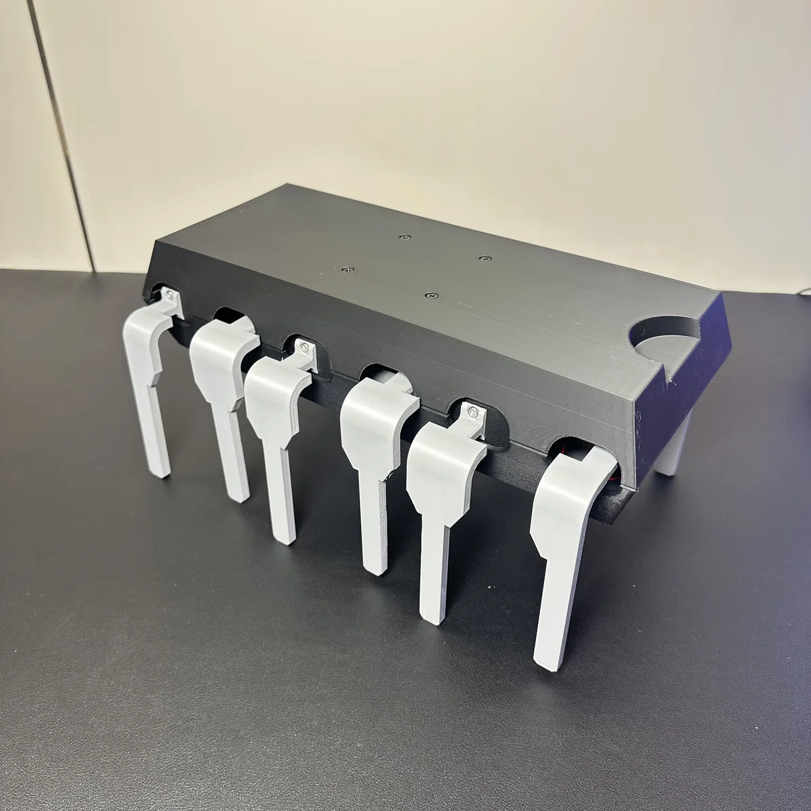
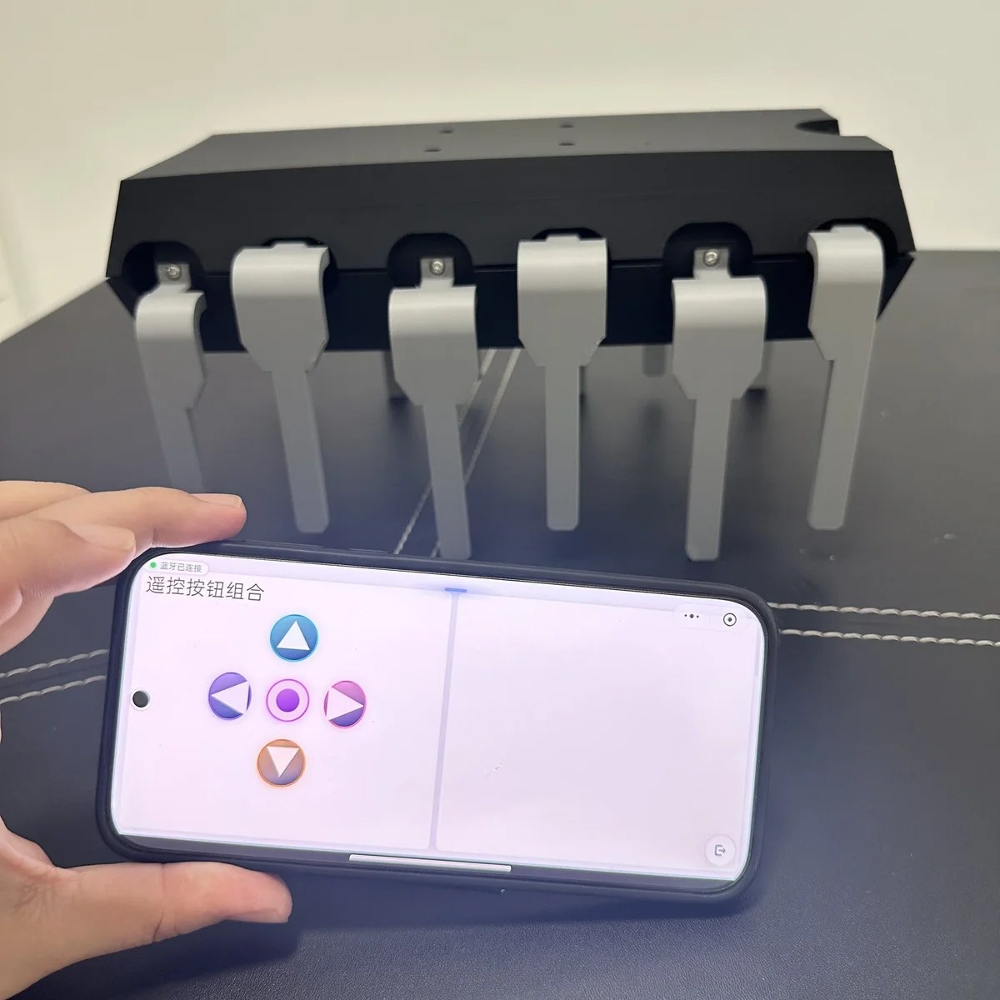
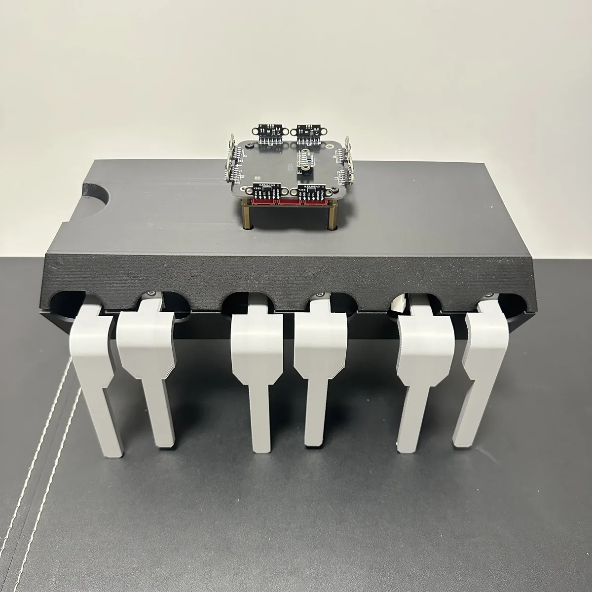
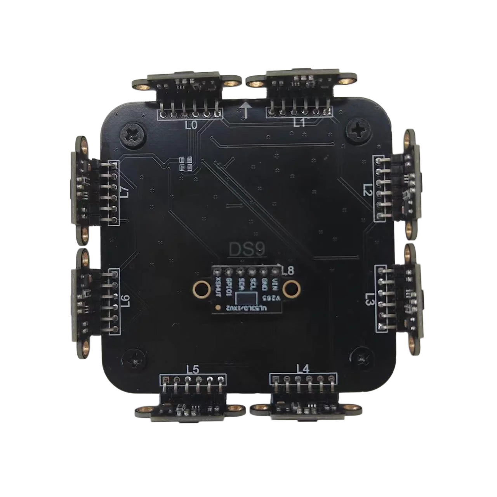
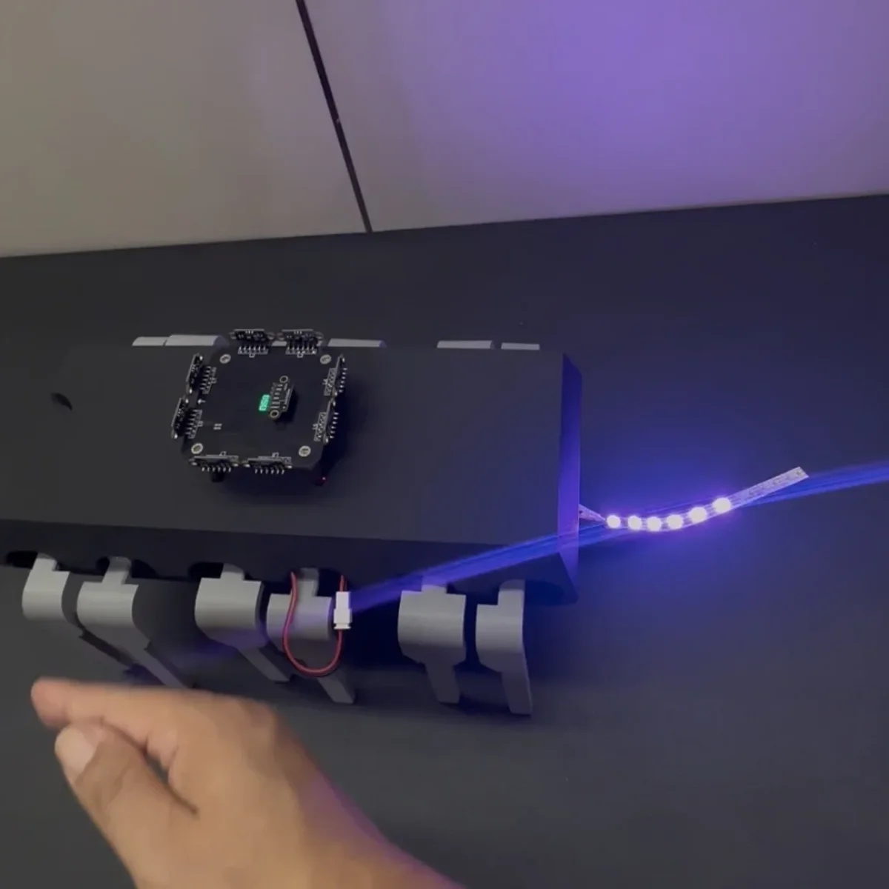

# WalkingChip

[中文](README.md) | [English](README_EN.md)

<p align="center">
  
</p>

This project uses FlexLua's CPU-302 AI auto-programming control unit, so you can make the 302 do what you want without coding. The 3D printing files are open-source and can be printed with a Bambu Lab 3D printer. Learn more about FlexLua at [flexlua.com](https://flexlua.com).

---

## Project 1: Phone Remote Control



### Project Introduction

This project controls the WalkingChip's movement (forward, backward, left, right) via the "Remote Button Group" widget in a phone Bluetooth App / Mini Program.

**Project video:** https://www.bilibili.com/video/BV1mptg6LE5g/

**The following conditions must be met to run this project:**

1. Have CPU-302 and related accessories ready.
2. In the App, check "Terminal" and add the "Remote Button Group" widget on the Terminal page.

### Pre-description

```
I made a "WalkingChip". Motors M0 and M1 drive its movement at maximum power. The M0/M1 control rules are:
WalkingChip turns left: M0 reverse, M1 reverse
WalkingChip turns right: M0 forward, M1 forward
WalkingChip moves forward: M0 reverse, M1 forward
WalkingChip moves backward: M0 forward, M1 reverse

The toy chip is also connected to 9 WS2812 color LEDs.

DS9 laser ranging sensors L0–L7 are arranged in pairs, evenly distributed clockwise on the four sides of a square. L0 and L1 face forward, L2 and L3 face right, L4 and L5 face backward, L6 and L7 face left. Invalid sensor readings are excluded from decisions.
```

### AI Prompt 1

```
I want to remotely control the "WalkingChip" to move forward, backward, turn left, and turn right via my phone.
```

### AI Prompt 2

```
When the "Up" button is pressed, move forward for 3 seconds.
When the "Down" button is pressed, move backward for 3 seconds.
When the "Left" button is pressed, spin left continuously for 10 seconds.
When the "Right" button is pressed, spin right continuously for 10 seconds.
```

---

## Project 2: Multi-channel Laser Obstacle Ranging & Avoidance





### Project Introduction

By adding a 9-channel laser ranging module, the chip detects nearby objects and actively avoids them (by moving in the opposite direction).

**Project video:** https://www.bilibili.com/video/BV1zztg6eEee/

**The following conditions must be met to run this project:**

1. Have CPU-302 and related accessories ready.
2. In the App, check the DS9 node (9-channel laser ranging module, each channel range ~1 m).

### Pre-description

```
I made a "WalkingChip". Motors M0 and M1 drive its movement at maximum power. The M0/M1 control rules are:
WalkingChip turns left: M0 reverse, M1 reverse
WalkingChip turns right: M0 forward, M1 forward
WalkingChip moves forward: M0 reverse, M1 forward
WalkingChip moves backward: M0 forward, M1 reverse

A DS9 laser ranging sensor is also connected. Sensors L0–L7 are arranged in pairs, evenly distributed clockwise on the four sides of a square. L0 and L1 face forward, L2 and L3 face right, L4 and L5 face backward, L6 and L7 face left. Invalid sensor readings are excluded from decisions.
```

### AI Prompt 1

```
Help me implement code: if a laser ranging sensor in any of the four directions detects an obstacle within 30 cm, the "WalkingChip" moves in the opposite direction.
```

### AI Prompt 2

```
I want to implement an autonomous obstacle-avoidance "WalkingChip". After power-on it moves forward by default and automatically avoids obstacles that are getting closer. If an object approaches from above within 15 cm, the chip accelerates to move left or right (depending on which side has more space).
```

---

## Project 3: Add a Color LED "Tail"



### Project Introduction

The laser ranging module detects nearby objects. Based on the object's direction and distance, it adjusts the number and color of the color LEDs.

**Project video:** https://www.bilibili.com/video/BV1fztg6eEk3/

**The following conditions must be met to run this project:**

1. Have CPU-302 and related accessories ready.
2. In the App, check the DS9 node (9-channel laser ranging module, each channel range ~1 m).

### Pre-description

```
I connected 9 WS2812 color LEDs to the "WalkingChip".

A DS9 laser ranging sensor is also connected. Sensors L0–L7 are arranged in pairs, evenly distributed clockwise on the four sides of a square. L0 and L1 face forward, L2 and L3 face right, L4 and L5 face backward, L6 and L7 face left. Invalid sensor readings are excluded from decisions.
```

### AI Prompt 1

```
I want the sensors in the four directions to light more LEDs as the detected distance gets closer within 30 cm. Each direction uses a different color, but only one color is shown at a time—the color of the direction with the nearest obstacle.
```

---

## Contact & Cooperation

- WeChat: stdlib-h
- Email: shineblink666@gmail.com
